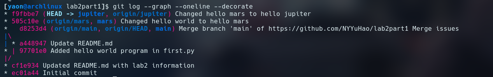
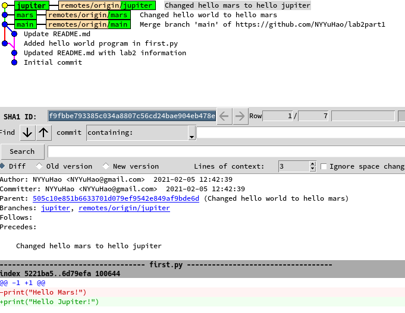
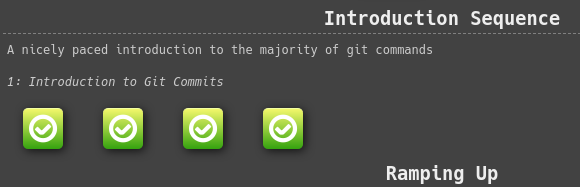
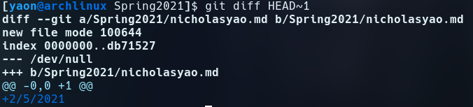
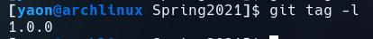

# Lab 2

# 1: New repository
[Lab 2 Part 1 Repository](https://github.com/NYYuHao/lab2part1)

## Git log and Gitk outputs

# 2: Spoon-Knife
## Spoon-Knife fork
[Spoon-Knife fork](https://github.com/NYYuHao/Spoon-Knife)

## Learn Git Branching

# 3: PullReq 
## PullReq Fork
[PullReq Fork](https://github.com/NYYuHao/PullReq)

## git diff output

## git tag -l output

## Common OSSProjectIdeas repo
[OSSProjectIdeas repo](https://github.com/MackQian/OSSProjectIdeas)
