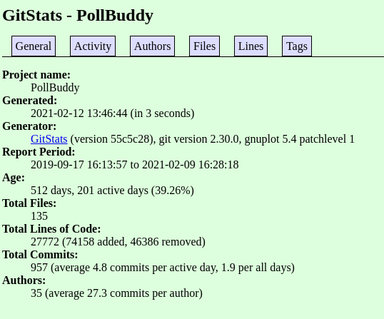
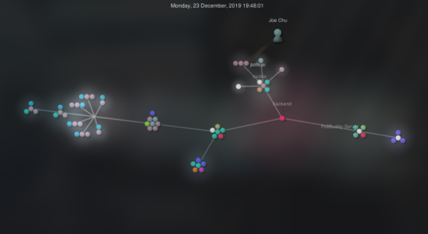
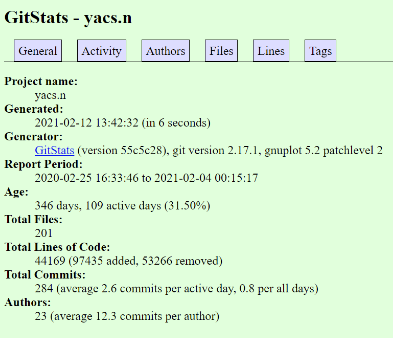
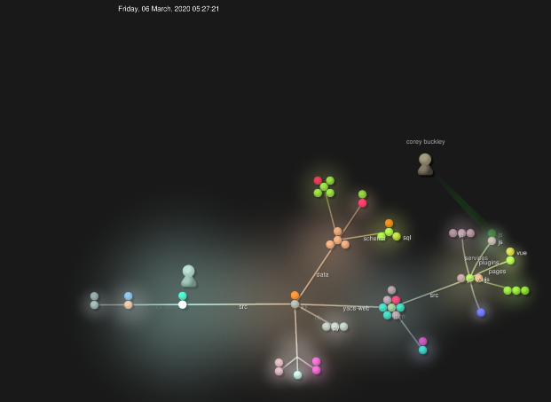
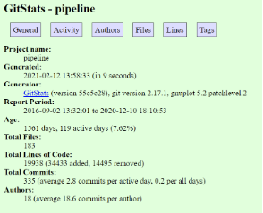
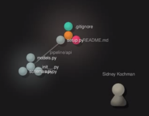
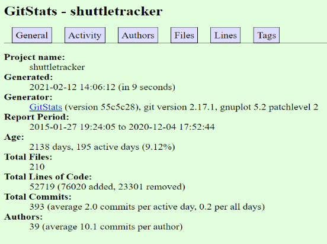
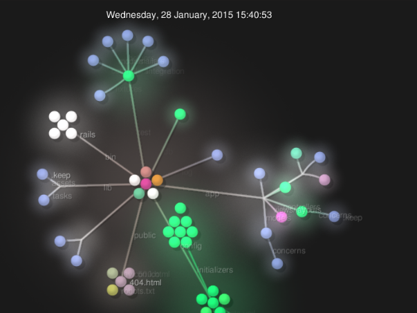

# 1: Wiki
[Wiki](https://github.com/NYYuHao/oss-repo-template/wiki)

# 2: Community
## [Poll Buddy](https://github.com/pollbuddy/pollbuddy)
Analysis by Nicholas Yao

24 contributors

28,239 lines of code in total

First commit:
* commit af1c1a0a26b2f6babc65d9a1258ddb1aa21768d9
* Author: neha-deshpande001
* Date: Tue Sep 17 16:13:57 2019 -0400
* “Initial commit”

Latest commit:
* commit 3942bbc599f82033541cef62d4176e4b7c0982d0 (HEAD -> email-system, origin/email-system)
* Author: hbh7
* Date: Tue Feb 9 16:28:18 2021 -0500
* “Small info comment”

8 branches in total:
* master
* email-system
* frontend
* backend
* issue-387
* users-docs
* questionEditorFunctionality
* instructor_view

GitStats shows that the project has 27,772 lines of code in total and 35 authors. I’m guessing the difference in lines of code is because GitStats probably does not include non-code files like READMEs. Activity mostly stopped about 2 months ago (9 weeks) but has picked up slowly within the past week. This explains the most recent commit happening on February 9th in the email-system branch. A large portion of the commits happen at 16:00 and on Tuesdays/Fridays, which makes sense since this is when RCOS is ongoing.

Gource is a really interesting visualizer for a project. Changes for Poll Buddy appear to happen in bursts which is probably because of pull requests adding features and because most changes are probably made during or around RCOS.

## [YACS](https://github.com/YACS-RCOS/yacs.n)
Analysis by Serena Chen

90 contributors 

44,600 lines of code

First commit:
* commit 58002dc5c721061a78a91a745f66d4833ad1468b
* Author: Jacob Shomstein <jacob@shomstein.com>
* Date: Tue Feb 25 16:33:46 2020 -0500

Latest commit:
* commit 91062273d905d14a7ce30c9a5d13ccbaf3b2fe7d (HEAD -> master, origin/master, origin/HEAD)
* Author: Daniel Ackermans <35609442+marchdan@users.noreply.github.com>
* Date: Thu Feb 4 00:15:17 2021 -0500

23 branches in total:
* remotes/origin/#230
* remotes/origin/#259
* remotes/origin/280-loadPageSpinner
* remotes/origin/338-mobile-ui-revised
* remotes/origin/52-scheduling
* remotes/origin/HEAD -> origin/master
* remotes/origin/add_vuex
* remotes/origin/admin_panel_ui
* remotes/origin/coursePage-recommendation
* remotes/origin/create-pull-request/patch
* remotes/origin/csv-fix
* remotes/origin/dark-mode
* remotes/origin/fixTimeSpring2021CSV
* remotes/origin/master
* remotes/origin/page_for_department
* remotes/origin/s21
* remotes/origin/seo
* remotes/origin/showDatabaseError
* remotes/origin/shruti_yacs
* remotes/origin/spring_2021_update
* remotes/origin/subject_fail_reload
* remotes/origin/summer2020-demo
* remotes/origin/windows_support

According to GitStats, YACS has been active for nearly a year now. They have 201 files and 44,169 lines of code in total. Although the YACS website lists 90 contributors, there are really only 23 authors. Looking at the activity graphs, we can see that most of the commits were made in February-April and October-December, which lines up with the Fall and Spring semesters. Jacob Shomstein is the author of the first commit; in fact, he made the most commits. However, Joshua Wu contributed with the most lines.

## [Pipeline](https://github.com/thepoly/pipeline)

15 contributors

21,509 lines of code in total

First commit:
* commit: a6ad321cfc676e8fcf3ed9e9c054f31029966757
* Author: Sidney Kochman
* Date: September 2, 2016

Latest commit:
* commit: dcec0a4cb1b425aa4afb5d109efa12ac70d33741
* Author: MacroLens Bot
* Date: December 10, 2020

70 branches in total:
* Bootswatch_dark_theme
* DarkModeFinal
* DarkTheme
* DarkTheme2
* Make_interactive_map_of_troy
* VarunNair22-patch-1
* Windows_Learning_Journal
* active-staff-email
* archives
* articlePageSubtypesTwo
* bump-django-version
* css-fix
* database-url
* dep-bump
* dependabot/npm_and_yarn/acorn-6.4.1
* dependabot/npm_and_yarn/dot-prop-4.2.1
* dependabot/npm_and_yarn/elliptic-6.5.3
* dependabot/npm_and_yarn/jquery-3.5.0
* dependabot/npm_and_yarn/lodash-4.17.19
* dependabot/npm_and_yarn/node-sass-4.13.1
* dependabot/pip/django-2.2.13
* dependabot/pip/wagtail-2.7.4
* deployed-branch
* django
* elections-default-fix
* elections-page
* fix-build-readme-etc
* fix-css
* fix-draft-visibility
* fix-nginx
* fix-reqs
* fixed-deployment
* fixes
* forms
* forms_revised
* gallery-changes
* github_templates
* hash-fix
* home_page_blocks
* image-centering-issue
* image-sizing
* importer-enhancements
* linux-documentation-charlie
* master
* maybe-fix
* models
* photo-changes
* photo-gallery-enhancements
* photo-staff-pages
* previous-staff
* readme-fix
* revert-pr#132
* rss_feed
* sassReformat
* searchbar
* snippet
* staff-page-improvements
* staff_archive
* staff_page_mods
* stream
* stylingDocumentation
* test-2020-branch
* test-branch
* text-to-speech-v2
* text_to_speech
* timeline
* update-deps
* updating-frameworks
* views

## [Shuttle Tracker](https://github.com/wtg/shuttletracker)

30 contributors

62,080 lines of code in total

First commit:
* commit 3453b12cb6d53080a0967644eddf44111fef0c54
* Author: gabe283 <perez283@gmail.com>
* Date: Tue Jan 27 19:24:05 2015 -0500

Latest commit:
* commit 3e8b9af6a7d8b341b605f137cf2b4577edd6bed3 (HEAD -> master, origin/master, origin/HEAD)
* Author: Matt Czyr <mattczyr@gmail.com>
* Date: Fri Dec 4 17:52:44 2020 -0500

57 branches in total:
* origin/HEAD -> origin/master
* origin/Stop-Editing
* origin/Stop-Editing-Dropdown
* origin/TV-Panel
* origin/TV-Panel-Fall2019
* origin/april-1
* origin/bus_button_always_on
* origin/change-tabbar-size
* origin/contribution-guidelines
* origin/dark-theme
* origin/debugRecording
* origin/documentation
* origin/dokku-nginx-conf
* origin/eta_refactored
* origin/export-routes
* origin/feature_msg
* origin/feedback
* origin/feedback2
* origin/github_corner
* origin/master
* origin/message-display
* origin/notification_frontend
* origin/notifications
* origin/polyLine_overlap
* origin/prediction_test
* origin/readme-changes
* origin/revert-271-dynamic-toggling
* origin/route-changes-tab
* origin/route-rewrite
* origin/route-scheduling
* origin/route_overlap
* origin/route_toggling
* origin/routes_cleanup
* origin/sample-vue
* origin/shuttle-slide
* origin/smooth-track-debug
* origin/smooth-tracking
* origin/smooth-tracking-algorithm
* origin/smooth-tracking-algorithm-2
* origin/smooth-tracking-algorithms
* origin/smooth-tracking-predict-light-stops
* origin/smooth-tracking-predict-turns
* origin/smooth-tracking-slide
* origin/smooth-tracking-test
* origin/smooth_tracking_debug
* origin/spoof
* origin/spoof-f20
* origin/stop_ordering
* origin/stops-editing
* origin/test
* origin/toggle-routes
* origin/tv-panel
* origin/typescriptvue
* origin/update-headings
* origin/update_Package
* origin/vehicle-stop-location

There were actually 39 different authors and 52719 lines of code with 210 active files. Sidney Cochman was the author with the most commits and has the most lines written. It is a very old repo, almost 6 years old. It saw a high amount of commits in the beginning few years but has slowed down a bit. 

