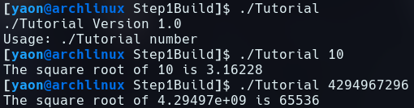

# CMake Tutorial

### Step 1

#### tutorial.cxx
```c
// A simple program that computes the square root of a number    
#include <cmath>    
#include <cstdlib>    
#include <iostream>    
#include <string>    
#include "TutorialConfig.h"    
    
int main(int argc, char* argv[])    
{    
  if (argc < 2) {    
    // Report version    
    std::cout << argv[0] << " Version " << Tutorial_VERSION_MAJOR << "."    
            << Tutorial_VERSION_MINOR << std::endl;    
    std::cout << "Usage: " << argv[0] << " number" << std::endl;    
    return 1;    
  }    
    
  // convert input to double    
  const double inputValue = std::stod(argv[1]);    
    
  // calculate square root    
  const double outputValue = sqrt(inputValue);    
  std::cout << "The square root of " << inputValue << " is " << outputValue    
            << std::endl;    
  return 0;    
}
```

#### CMakeLists.txt
```cmake
cmake_minimum_required(VERSION 3.10)        
       
# set the project name        
project(Tutorial VERSION 1.0)        
    
set(CMAKE_CXX_STANDARD 11)    
set(CMAKE_CXX_STANDARD_REQUIRED True)    
       
configure_file(TutorialConfig.h.in TutorialConfig.h)    
    
# add the executable        
add_executable(Tutorial tutorial.cxx)    
    
target_include_directories(Tutorial PUBLIC "${PROJECT_BINARY_DIR}")
```

#### Tutorial Output

