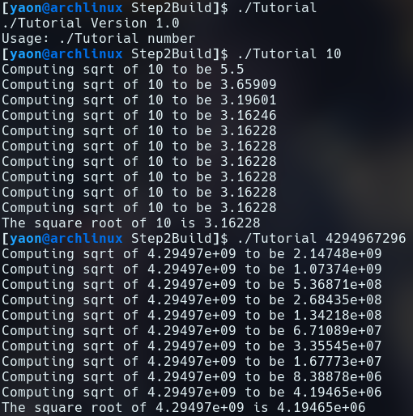

# CMake Tutorial

### Step 1

#### tutorial.cxx
```c
// A simple program that computes the square root of a number    
#include <cmath>    
#include <cstdlib>    
#include <iostream>    
#include <string>    
#include "TutorialConfig.h"    
    
int main(int argc, char* argv[])    
{    
  if (argc < 2) {    
    // Report version    
    std::cout << argv[0] << " Version " << Tutorial_VERSION_MAJOR << "."    
            << Tutorial_VERSION_MINOR << std::endl;    
    std::cout << "Usage: " << argv[0] << " number" << std::endl;    
    return 1;    
  }    
    
  // convert input to double    
  const double inputValue = std::stod(argv[1]);    
    
  // calculate square root    
  const double outputValue = sqrt(inputValue);    
  std::cout << "The square root of " << inputValue << " is " << outputValue    
            << std::endl;    
  return 0;    
}
```

#### CMakeLists.txt
```cmake
cmake_minimum_required(VERSION 3.10)        
       
# set the project name        
project(Tutorial VERSION 1.0)        
    
set(CMAKE_CXX_STANDARD 11)    
set(CMAKE_CXX_STANDARD_REQUIRED True)    
       
configure_file(TutorialConfig.h.in TutorialConfig.h)    
    
# add the executable        
add_executable(Tutorial tutorial.cxx)    
    
target_include_directories(Tutorial PUBLIC "${PROJECT_BINARY_DIR}")
```

#### Tutorial Output


### Step 2

#### tutorial.cxx
```c
// A simple program that computes the square root of a number    
#include <cmath>    
#include <iostream>    
#include <string>    
#include "TutorialConfig.h"    
#ifdef USE_MYMATH    
        #include "MathFunctions.h"    
#endif    
    
int main(int argc, char* argv[])    
{    
  if (argc < 2) {    
    // report version    
    std::cout << argv[0] << " Version " << Tutorial_VERSION_MAJOR << "."    
              << Tutorial_VERSION_MINOR << std::endl;    
    std::cout << "Usage: " << argv[0] << " number" << std::endl;    
    return 1;    
  }    
    
  // convert input to double    
  const double inputValue = std::stod(argv[1]);    
    
  // calculate square root    
#ifdef USE_MYMATH    
  const double outputValue = mysqrt(inputValue);    
#else    
  const double outputValue = sqrt(inputValue);    
#endif    
  std::cout << "The square root of " << inputValue << " is " << outputValue    
            << std::endl;    
  return 0;    
}
```

#### TutorialConfig.h.in
```c
// the configured options and settings for Tutorial    
#define Tutorial_VERSION_MAJOR @Tutorial_VERSION_MAJOR@    
#define Tutorial_VERSION_MINOR @Tutorial_VERSION_MINOR@    
#cmakedefine USE_MYMATH
```

#### CMakeLists.txt
```cmake
cmake_minimum_required(VERSION 3.10)    
    
# set the project name and version    
project(Tutorial VERSION 1.0)    
    
# specify the C++ standard    
set(CMAKE_CXX_STANDARD 11)    
set(CMAKE_CXX_STANDARD_REQUIRED True)    
    
option(USE_MYMATH "Use tutorial provided math implementation" ON)    
    
# configure a header file to pass some of the CMake settings    
# to the source code    
configure_file(TutorialConfig.h.in TutorialConfig.h)    
    
if(USE_MYMATH)    
        add_subdirectory(MathFunctions)    
        list(APPEND EXTRA_LIBS MathFunctions)    
        list(APPEND EXTRA_INCLUDES "${PROJECT_SOURCE_DIR}/MathFunctions")    
endif()    
    
# add the executable    
add_executable(Tutorial tutorial.cxx)    
    
target_link_libraries(Tutorial PUBLIC ${EXTRA_LIBS})    
    
# add the binary tree to the search path for include files    
# so that we will find TutorialConfig.h    
target_include_directories(Tutorial PUBLIC    
                           "${PROJECT_BINARY_DIR}"    
                           ${EXTRA_INCLUDES}    
                           )
```

#### Tutorial Output


### Step 3

#### CMakeLists.txt
```cmake
cmake_minimum_required(VERSION 3.10)    
    
# set the project name and version    
project(Tutorial VERSION 1.0)    
    
# specify the C++ standard    
set(CMAKE_CXX_STANDARD 11)    
set(CMAKE_CXX_STANDARD_REQUIRED True)    
    
# should we use our own math functions    
option(USE_MYMATH "Use tutorial provided math implementation" ON)    
    
# configure a header file to pass some of the CMake settings    
# to the source code    
configure_file(TutorialConfig.h.in TutorialConfig.h)    
    
# add the MathFunctions library    
if(USE_MYMATH)    
  add_subdirectory(MathFunctions)    
  list(APPEND EXTRA_LIBS MathFunctions)    
endif()    
    
# add the executable    
add_executable(Tutorial tutorial.cxx)    
    
target_link_libraries(Tutorial PUBLIC ${EXTRA_LIBS})    
    
# add the binary tree to the search path for include files    
# so that we will find TutorialConfig.h    
target_include_directories(Tutorial PUBLIC    
                           "${PROJECT_BINARY_DIR}"    
                           )
```

#### MathFunctions/CMakeLists.txt
```cmake
add_library(MathFunctions mysqrt.cxx)    
    
target_include_directories(MathFunctions INTERFACE ${CMAKE_CURRENT_SOURCE_DIR})
```

#### Tutorial Output


### Step 4

#### CMakeLists.txt
```cmake
cmake_minimum_required(VERSION 3.10)    
    
# set the project name and version    
project(Tutorial VERSION 1.0)    
    
# specify the C++ standard    
set(CMAKE_CXX_STANDARD 11)    
set(CMAKE_CXX_STANDARD_REQUIRED True)    
    
# should we use our own math functions    
option(USE_MYMATH "Use tutorial provided math implementation" ON)    
    
# configure a header file to pass some of the CMake settings    
# to the source code    
configure_file(TutorialConfig.h.in TutorialConfig.h)    
    
# add the MathFunctions library    
if(USE_MYMATH)    
  add_subdirectory(MathFunctions)    
  list(APPEND EXTRA_LIBS MathFunctions)    
endif()    
    
# add the executable    
add_executable(Tutorial tutorial.cxx)    
    
target_link_libraries(Tutorial PUBLIC ${EXTRA_LIBS})    
    
# add the binary tree to the search path for include files    
# so that we will find TutorialConfig.h    
target_include_directories(Tutorial PUBLIC    
                           "${PROJECT_BINARY_DIR}"    
                           )    
    
install(TARGETS Tutorial DESTINATION bin)    
install(FILES "${PROJECT_BINARY_DIR}/TutorialConfig.h"    
  DESTINATION include    
  )    
    
enable_testing()    
    
# does the application run    
add_test(NAME Runs COMMAND Tutorial 25)    
    
# does the usage message work?    
add_test(NAME Usage COMMAND Tutorial)    
set_tests_properties(Usage    
  PROPERTIES PASS_REGULAR_EXPRESSION "Usage:.*number"    
  )    
    
# define a function to simplify adding tests    
function(do_test target arg result)    
  add_test(NAME Comp${arg} COMMAND ${target} ${arg})
  set_tests_properties(Comp${arg}
    PROPERTIES PASS_REGULAR_EXPRESSION ${result}
    )
endfunction(do_test)

# do a bunch of result based tests
do_test(Tutorial 4 "4 is 2")
do_test(Tutorial 9 "9 is 3")
do_test(Tutorial 5 "5 is 2.236")
do_test(Tutorial 7 "7 is 2.645")
do_test(Tutorial 25 "25 is 5")
do_test(Tutorial -25 "-25 is [-nan|nan|0]")
do_test(Tutorial 0.0001 "0.0001 is 0.01")
```

#### MathFunctions/CMakeLists.txt
```cmake
add_library(MathFunctions mysqrt.cxx)    
    
# state that anybody linking to us needs to include the current source dir    
# to find MathFunctions.h, while we don't.    
target_include_directories(MathFunctions    
          INTERFACE ${CMAKE_CURRENT_SOURCE_DIR}    
          )    
    
install(TARGETS MathFunctions DESTINATION lib)    
install(FILES MathFunctions.h DESTINATION include)
```

#### ctest -VV Output
```
UpdateCTestConfiguration  from :/home/yaon/Class/OpenSourceSoftware/locallabs/cmake/Help/guide/tutorial/Step4/Step4Build/DartConfiguration.tcl
UpdateCTestConfiguration  from :/home/yaon/Class/OpenSourceSoftware/locallabs/cmake/Help/guide/tutorial/Step4/Step4Build/DartConfiguration.tcl
Test project /home/yaon/Class/OpenSourceSoftware/locallabs/cmake/Help/guide/tutorial/Step4/Step4Build
Constructing a list of tests
Done constructing a list of tests
Updating test list for fixtures
Added 0 tests to meet fixture requirements
Checking test dependency graph...
Checking test dependency graph end
test 1
    Start 1: Runs

1: Test command: /home/yaon/Class/OpenSourceSoftware/locallabs/cmake/Help/guide/tutorial/Step4/Step4Build/Tutorial "25"
1: Test timeout computed to be: 10000000
1: Computing sqrt of 25 to be 13
1: Computing sqrt of 25 to be 7.46154
1: Computing sqrt of 25 to be 5.40603
1: Computing sqrt of 25 to be 5.01525
1: Computing sqrt of 25 to be 5.00002
1: Computing sqrt of 25 to be 5
1: Computing sqrt of 25 to be 5
1: Computing sqrt of 25 to be 5
1: Computing sqrt of 25 to be 5
1: Computing sqrt of 25 to be 5
1: The square root of 25 is 5
1/9 Test #1: Runs .............................   Passed    0.00 sec
test 2
    Start 2: Usage

2: Test command: /home/yaon/Class/OpenSourceSoftware/locallabs/cmake/Help/guide/tutorial/Step4/Step4Build/Tutorial
2: Test timeout computed to be: 10000000
2: /home/yaon/Class/OpenSourceSoftware/locallabs/cmake/Help/guide/tutorial/Step4/Step4Build/Tutorial Version 1.0
2: Usage: /home/yaon/Class/OpenSourceSoftware/locallabs/cmake/Help/guide/tutorial/Step4/Step4Build/Tutorial number
2/9 Test #2: Usage ............................   Passed    0.00 sec
test 3
    Start 3: Comp4

3: Test command: /home/yaon/Class/OpenSourceSoftware/locallabs/cmake/Help/guide/tutorial/Step4/Step4Build/Tutorial "4"
3: Test timeout computed to be: 10000000
3: Computing sqrt of 4 to be 2.5
3: Computing sqrt of 4 to be 2.05
3: Computing sqrt of 4 to be 2.00061
3: Computing sqrt of 4 to be 2
3: Computing sqrt of 4 to be 2
3: Computing sqrt of 4 to be 2
3: Computing sqrt of 4 to be 2
3: Computing sqrt of 4 to be 2
3: Computing sqrt of 4 to be 2
3: Computing sqrt of 4 to be 2
3: The square root of 4 is 2
3/9 Test #3: Comp4 ............................   Passed    0.00 sec
test 4
    Start 4: Comp9

4: Test command: /home/yaon/Class/OpenSourceSoftware/locallabs/cmake/Help/guide/tutorial/Step4/Step4Build/Tutorial "9"
4: Test timeout computed to be: 10000000
4: Computing sqrt of 9 to be 5
4: Computing sqrt of 9 to be 3.4
4: Computing sqrt of 9 to be 3.02353
4: Computing sqrt of 9 to be 3.00009
4: Computing sqrt of 9 to be 3
4: Computing sqrt of 9 to be 3
4: Computing sqrt of 9 to be 3
4: Computing sqrt of 9 to be 3
4: Computing sqrt of 9 to be 3
4: Computing sqrt of 9 to be 3
4: The square root of 9 is 3
4/9 Test #4: Comp9 ............................   Passed    0.00 sec
test 5
    Start 5: Comp5

5: Test command: /home/yaon/Class/OpenSourceSoftware/locallabs/cmake/Help/guide/tutorial/Step4/Step4Build/Tutorial "5"
5: Test timeout computed to be: 10000000
5: Computing sqrt of 5 to be 3
5: Computing sqrt of 5 to be 2.33333
5: Computing sqrt of 5 to be 2.2381
5: Computing sqrt of 5 to be 2.23607
5: Computing sqrt of 5 to be 2.23607
5: Computing sqrt of 5 to be 2.23607
5: Computing sqrt of 5 to be 2.23607
5: Computing sqrt of 5 to be 2.23607
5: Computing sqrt of 5 to be 2.23607
5: Computing sqrt of 5 to be 2.23607
5: The square root of 5 is 2.23607
5/9 Test #5: Comp5 ............................   Passed    0.00 sec
test 6
    Start 6: Comp7

6: Test command: /home/yaon/Class/OpenSourceSoftware/locallabs/cmake/Help/guide/tutorial/Step4/Step4Build/Tutorial "7"
6: Test timeout computed to be: 10000000
6: Computing sqrt of 7 to be 4
6: Computing sqrt of 7 to be 2.875
6: Computing sqrt of 7 to be 2.65489
6: Computing sqrt of 7 to be 2.64577
6: Computing sqrt of 7 to be 2.64575
6: Computing sqrt of 7 to be 2.64575
6: Computing sqrt of 7 to be 2.64575
6: Computing sqrt of 7 to be 2.64575
6: Computing sqrt of 7 to be 2.64575
6: Computing sqrt of 7 to be 2.64575
6: The square root of 7 is 2.64575
6/9 Test #6: Comp7 ............................   Passed    0.00 sec
test 7
    Start 7: Comp25

7: Test command: /home/yaon/Class/OpenSourceSoftware/locallabs/cmake/Help/guide/tutorial/Step4/Step4Build/Tutorial "25"
7: Test timeout computed to be: 10000000
7: Computing sqrt of 25 to be 13
7: Computing sqrt of 25 to be 7.46154
7: Computing sqrt of 25 to be 5.40603
7: Computing sqrt of 25 to be 5.01525
7: Computing sqrt of 25 to be 5.00002
7: Computing sqrt of 25 to be 5
7: Computing sqrt of 25 to be 5
7: Computing sqrt of 25 to be 5
7: Computing sqrt of 25 to be 5
7: Computing sqrt of 25 to be 5
7: The square root of 25 is 5
7/9 Test #7: Comp25 ...........................   Passed    0.00 sec
test 8
    Start 8: Comp-25

8: Test command: /home/yaon/Class/OpenSourceSoftware/locallabs/cmake/Help/guide/tutorial/Step4/Step4Build/Tutorial "-25"
8: Test timeout computed to be: 10000000
8: The square root of -25 is 0
8/9 Test #8: Comp-25 ..........................   Passed    0.00 sec
test 9
    Start 9: Comp0.0001

9: Test command: /home/yaon/Class/OpenSourceSoftware/locallabs/cmake/Help/guide/tutorial/Step4/Step4Build/Tutorial "0.0001"
9: Test timeout computed to be: 10000000
9: Computing sqrt of 0.0001 to be 0.50005
9: Computing sqrt of 0.0001 to be 0.250125
9: Computing sqrt of 0.0001 to be 0.125262
9: Computing sqrt of 0.0001 to be 0.0630304
9: Computing sqrt of 0.0001 to be 0.0323084
9: Computing sqrt of 0.0001 to be 0.0177018
9: Computing sqrt of 0.0001 to be 0.0116755
9: Computing sqrt of 0.0001 to be 0.0101202
9: Computing sqrt of 0.0001 to be 0.0100007
9: Computing sqrt of 0.0001 to be 0.01
9: The square root of 0.0001 is 0.01
9/9 Test #9: Comp0.0001 .......................   Passed    0.00 sec

100% tests passed, 0 tests failed out of 9

Total Test time (real) =   0.02 sec
```

### Step 5

#### CMakeLists.txt
```cmake
make_minimum_required(VERSION 3.10)    
    
# set the project name and version    
project(Tutorial VERSION 1.0)    
    
# specify the C++ standard    
set(CMAKE_CXX_STANDARD 11)    
set(CMAKE_CXX_STANDARD_REQUIRED True)    
    
# should we use our own math functions    
option(USE_MYMATH "Use tutorial provided math implementation" ON)    
    
# configure a header file to pass some of the CMake settings    
# to the source code    
configure_file(TutorialConfig.h.in TutorialConfig.h)    
    
# add the MathFunctions library    
if(USE_MYMATH)    
  add_subdirectory(MathFunctions)    
  list(APPEND EXTRA_LIBS MathFunctions)    
endif()    
    
# add the executable    
add_executable(Tutorial tutorial.cxx)    
target_link_libraries(Tutorial PUBLIC ${EXTRA_LIBS})    
    
# add the binary tree to the search path for include files    
# so that we will find TutorialConfig.h    
target_include_directories(Tutorial PUBLIC    
                           "${PROJECT_BINARY_DIR}"    
                           )    
    
# add the install targets    
install(TARGETS Tutorial DESTINATION bin)    
install(FILES "${PROJECT_BINARY_DIR}/TutorialConfig.h"    
  DESTINATION include    
  )    
    
# enable testing    
enable_testing()    
    
# does the application run    
add_test(NAME Runs COMMAND Tutorial 25)    
    
# does the usage message work?    
add_test(NAME Usage COMMAND Tutorial)    
set_tests_properties(Usage    
  PROPERTIES PASS_REGULAR_EXPRESSION "Usage:.*number"    
  )    
    
# define a function to simplify adding tests    
function(do_test target arg result)
```

#### MathFunctions/CMakeLists.txt
```cmake
add_library(MathFunctions mysqrt.cxx)    
    
# state that anybody linking to us needs to include the current source dir    
# to find MathFunctions.h, while we don't.    
target_include_directories(MathFunctions    
          INTERFACE ${CMAKE_CURRENT_SOURCE_DIR}    
          )    
    
# install rules    
install(TARGETS MathFunctions DESTINATION lib)    
install(FILES MathFunctions.h DESTINATION include)    
    
include(CheckSymbolExists)    
check_symbol_exists(log "math.h" HAVE_LOG)    
check_symbol_exists(exp "math.h" HAVE_EXP)    
if(NOT (HAVE_LOG AND HAVE_EXP))    
  unset(HAVE_LOG CACHE)    
  unset(HAVE_EXP CACHE)    
  set(CMAKE_REQUIRED_LIBRARIES "m")    
  check_symbol_exists(log "math.h" HAVE_LOG)    
  check_symbol_exists(exp "math.h" HAVE_EXP)    
  if(HAVE_LOG AND HAVE_EXP)    
    target_link_libraries(MathFunctions PRIVATE m)    
  endif()    
endif()    
    
if(HAVE_LOG AND HAVE_EXP)    
  target_compile_definitions(MathFunctions    
                             PRIVATE "HAVE_LOG" "HAVE_EXP")    
endif()
```

#### Tutorial Output


### Make and CMake

#### Makefile
```make
all: dynamic_block static_block
# clean to remove all related files
clean: 
	rm dynamic_block static_block libblock.so libblock.a block.o program.o

# Create dynamic_block executable by compiling with shared library, which
# requires rpath to be correctly set so the program knows where the shared
# library is
dynamic_block: libblock.so program.o
	cc program.o libblock.so -o dynamic_block -Wl,-rpath=./
libblock.so: block.o
	cc -shared -o libblock.so block.o

# Create static_block executable by compiling with the static, archived library
static_block: libblock.a program.o
	cc program.o libblock.a -o static_block
libblock.a: block.o
	ar qc libblock.a block.o

# Compile code once with PIC (position independent code) for dynamic linking
# Also have implicit dependencies (header file)
block.o: source/block.c headers/block.h
	cc -fPIC -c source/block.c -o block.o
program.o: program.c headers/block.h
	cc -fPIC -c program.c -o program.o
```

#### CMakeLists.txt
```cmake
cmake_minimum_required(VERSION 3.10)
project(Lab5CMake)

# Compile dynamic_block with program.c
add_executable(dynamic_block program.c)
target_include_directories(dynamic_block PUBLIC
	"${PROJECT_BINARY_DIR}"
	"${PROJECT_SOURCE_DIR}/headers")
# Create the shared library and link it to the executable
add_library(libdynamicblock SHARED source/block.c)
target_link_libraries(dynamic_block PUBLIC
	libdynamicblock)

# Compile static_block with program.c
add_executable(static_block program.c)
target_include_directories(static_block PUBLIC
	"${PROJECT_BINARY_DIR}"
	"${PROJECT_SOURCE_DIR}/headers")
# Create the static library and link it to the executable
add_library(libstaticblock STATIC source/block.c)
target_link_libraries(static_block PUBLIC
	libstaticblock)
```

#### CMake Makefile
```make
# CMAKE generated file: DO NOT EDIT!
# Generated by "Unix Makefiles" Generator, CMake Version 3.19

# Default target executed when no arguments are given to make.
default_target: all

.PHONY : default_target

# Allow only one "make -f Makefile2" at a time, but pass parallelism.
.NOTPARALLEL:


#=============================================================================
# Special targets provided by cmake.

# Disable implicit rules so canonical targets will work.
.SUFFIXES:


# Disable VCS-based implicit rules.
% : %,v


# Disable VCS-based implicit rules.
% : RCS/%


# Disable VCS-based implicit rules.
% : RCS/%,v


# Disable VCS-based implicit rules.
% : SCCS/s.%


# Disable VCS-based implicit rules.
% : s.%


.SUFFIXES: .hpux_make_needs_suffix_list


# Command-line flag to silence nested $(MAKE).
$(VERBOSE)MAKESILENT = -s

#Suppress display of executed commands.
$(VERBOSE).SILENT:

# A target that is always out of date.
cmake_force:

.PHONY : cmake_force

#=============================================================================
# Set environment variables for the build.

# The shell in which to execute make rules.
SHELL = /bin/sh

# The CMake executable.
CMAKE_COMMAND = /usr/bin/cmake

# The command to remove a file.
RM = /usr/bin/cmake -E rm -f

# Escaping for special characters.
EQUALS = =

# The top-level source directory on which CMake was run.
CMAKE_SOURCE_DIR = /home/yaon/Class/OpenSourceSoftware/CSCI-4470-OpenSource/Modules/05.BuildSystems/Lab-BuildSystemsExample

# The top-level build directory on which CMake was run.
CMAKE_BINARY_DIR = /home/yaon/Class/OpenSourceSoftware/CSCI-4470-OpenSource/Modules/05.BuildSystems/Lab-BuildSystemsExample/build

#=============================================================================
# Targets provided globally by CMake.

# Special rule for the target rebuild_cache
rebuild_cache:
	@$(CMAKE_COMMAND) -E cmake_echo_color --switch=$(COLOR) --cyan "Running CMake to regenerate build system..."
	/usr/bin/cmake --regenerate-during-build -S$(CMAKE_SOURCE_DIR) -B$(CMAKE_BINARY_DIR)
.PHONY : rebuild_cache

# Special rule for the target rebuild_cache
rebuild_cache/fast: rebuild_cache

.PHONY : rebuild_cache/fast

# Special rule for the target edit_cache
edit_cache:
	@$(CMAKE_COMMAND) -E cmake_echo_color --switch=$(COLOR) --cyan "Running CMake cache editor..."
	/usr/bin/ccmake -S$(CMAKE_SOURCE_DIR) -B$(CMAKE_BINARY_DIR)
.PHONY : edit_cache

# Special rule for the target edit_cache
edit_cache/fast: edit_cache

.PHONY : edit_cache/fast

# The main all target
all: cmake_check_build_system
	$(CMAKE_COMMAND) -E cmake_progress_start /home/yaon/Class/OpenSourceSoftware/CSCI-4470-OpenSource/Modules/05.BuildSystems/Lab-BuildSystemsExample/build/CMakeFiles /home/yaon/Class/OpenSourceSoftware/CSCI-4470-OpenSource/Modules/05.BuildSystems/Lab-BuildSystemsExample/build//CMakeFiles/progress.marks
	$(MAKE) $(MAKESILENT) -f CMakeFiles/Makefile2 all
	$(CMAKE_COMMAND) -E cmake_progress_start /home/yaon/Class/OpenSourceSoftware/CSCI-4470-OpenSource/Modules/05.BuildSystems/Lab-BuildSystemsExample/build/CMakeFiles 0
.PHONY : all

# The main clean target
clean:
	$(MAKE) $(MAKESILENT) -f CMakeFiles/Makefile2 clean
.PHONY : clean

# The main clean target
clean/fast: clean

.PHONY : clean/fast

# Prepare targets for installation.
preinstall: all
	$(MAKE) $(MAKESILENT) -f CMakeFiles/Makefile2 preinstall
.PHONY : preinstall

# Prepare targets for installation.
preinstall/fast:
	$(MAKE) $(MAKESILENT) -f CMakeFiles/Makefile2 preinstall
.PHONY : preinstall/fast

# clear depends
depend:
	$(CMAKE_COMMAND) -S$(CMAKE_SOURCE_DIR) -B$(CMAKE_BINARY_DIR) --check-build-system CMakeFiles/Makefile.cmake 1
.PHONY : depend

#=============================================================================
# Target rules for targets named libstaticblock

# Build rule for target.
libstaticblock: cmake_check_build_system
	$(MAKE) $(MAKESILENT) -f CMakeFiles/Makefile2 libstaticblock
.PHONY : libstaticblock

# fast build rule for target.
libstaticblock/fast:
	$(MAKE) $(MAKESILENT) -f CMakeFiles/libstaticblock.dir/build.make CMakeFiles/libstaticblock.dir/build
.PHONY : libstaticblock/fast

#=============================================================================
# Target rules for targets named libdynamicblock

# Build rule for target.
libdynamicblock: cmake_check_build_system
	$(MAKE) $(MAKESILENT) -f CMakeFiles/Makefile2 libdynamicblock
.PHONY : libdynamicblock

# fast build rule for target.
libdynamicblock/fast:
	$(MAKE) $(MAKESILENT) -f CMakeFiles/libdynamicblock.dir/build.make CMakeFiles/libdynamicblock.dir/build
.PHONY : libdynamicblock/fast

#=============================================================================
# Target rules for targets named static_block

# Build rule for target.
static_block: cmake_check_build_system
	$(MAKE) $(MAKESILENT) -f CMakeFiles/Makefile2 static_block
.PHONY : static_block

# fast build rule for target.
static_block/fast:
	$(MAKE) $(MAKESILENT) -f CMakeFiles/static_block.dir/build.make CMakeFiles/static_block.dir/build
.PHONY : static_block/fast

#=============================================================================
# Target rules for targets named dynamic_block

# Build rule for target.
dynamic_block: cmake_check_build_system
	$(MAKE) $(MAKESILENT) -f CMakeFiles/Makefile2 dynamic_block
.PHONY : dynamic_block

# fast build rule for target.
dynamic_block/fast:
	$(MAKE) $(MAKESILENT) -f CMakeFiles/dynamic_block.dir/build.make CMakeFiles/dynamic_block.dir/build
.PHONY : dynamic_block/fast

program.o: program.c.o

.PHONY : program.o

# target to build an object file
program.c.o:
	$(MAKE) $(MAKESILENT) -f CMakeFiles/static_block.dir/build.make CMakeFiles/static_block.dir/program.c.o
	$(MAKE) $(MAKESILENT) -f CMakeFiles/dynamic_block.dir/build.make CMakeFiles/dynamic_block.dir/program.c.o
.PHONY : program.c.o

program.i: program.c.i

.PHONY : program.i

# target to preprocess a source file
program.c.i:
	$(MAKE) $(MAKESILENT) -f CMakeFiles/static_block.dir/build.make CMakeFiles/static_block.dir/program.c.i
	$(MAKE) $(MAKESILENT) -f CMakeFiles/dynamic_block.dir/build.make CMakeFiles/dynamic_block.dir/program.c.i
.PHONY : program.c.i

program.s: program.c.s

.PHONY : program.s

# target to generate assembly for a file
program.c.s:
	$(MAKE) $(MAKESILENT) -f CMakeFiles/static_block.dir/build.make CMakeFiles/static_block.dir/program.c.s
	$(MAKE) $(MAKESILENT) -f CMakeFiles/dynamic_block.dir/build.make CMakeFiles/dynamic_block.dir/program.c.s
.PHONY : program.c.s

source/block.o: source/block.c.o

.PHONY : source/block.o

# target to build an object file
source/block.c.o:
	$(MAKE) $(MAKESILENT) -f CMakeFiles/libstaticblock.dir/build.make CMakeFiles/libstaticblock.dir/source/block.c.o
	$(MAKE) $(MAKESILENT) -f CMakeFiles/libdynamicblock.dir/build.make CMakeFiles/libdynamicblock.dir/source/block.c.o
.PHONY : source/block.c.o

source/block.i: source/block.c.i

.PHONY : source/block.i

# target to preprocess a source file
source/block.c.i:
	$(MAKE) $(MAKESILENT) -f CMakeFiles/libstaticblock.dir/build.make CMakeFiles/libstaticblock.dir/source/block.c.i
	$(MAKE) $(MAKESILENT) -f CMakeFiles/libdynamicblock.dir/build.make CMakeFiles/libdynamicblock.dir/source/block.c.i
.PHONY : source/block.c.i

source/block.s: source/block.c.s

.PHONY : source/block.s

# target to generate assembly for a file
source/block.c.s:
	$(MAKE) $(MAKESILENT) -f CMakeFiles/libstaticblock.dir/build.make CMakeFiles/libstaticblock.dir/source/block.c.s
	$(MAKE) $(MAKESILENT) -f CMakeFiles/libdynamicblock.dir/build.make CMakeFiles/libdynamicblock.dir/source/block.c.s
.PHONY : source/block.c.s

# Help Target
help:
	@echo "The following are some of the valid targets for this Makefile:"
	@echo "... all (the default if no target is provided)"
	@echo "... clean"
	@echo "... depend"
	@echo "... edit_cache"
	@echo "... rebuild_cache"
	@echo "... dynamic_block"
	@echo "... libdynamicblock"
	@echo "... libstaticblock"
	@echo "... static_block"
	@echo "... program.o"
	@echo "... program.i"
	@echo "... program.s"
	@echo "... source/block.o"
	@echo "... source/block.i"
	@echo "... source/block.s"
.PHONY : help


#=============================================================================
# Special targets to cleanup operation of make.

# Special rule to run CMake to check the build system integrity.
# No rule that depends on this can have commands that come from listfiles
# because they might be regenerated.
cmake_check_build_system:
	$(CMAKE_COMMAND) -S$(CMAKE_SOURCE_DIR) -B$(CMAKE_BINARY_DIR) --check-build-system CMakeFiles/Makefile.cmake 0
.PHONY : cmake_check_build_system
```

For both make and cmake, static_block has a file size of 16256 bytes while
dynamic_block has a file size of 16080, so using the shared library instead of
static decreased the size of the executable by 176 bytes.

#### make executable output


#### cmake executable output

