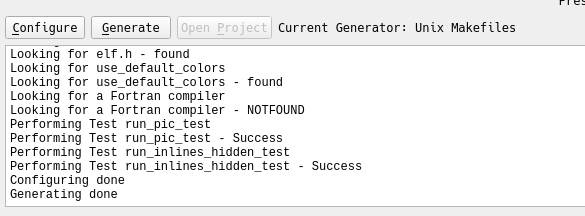
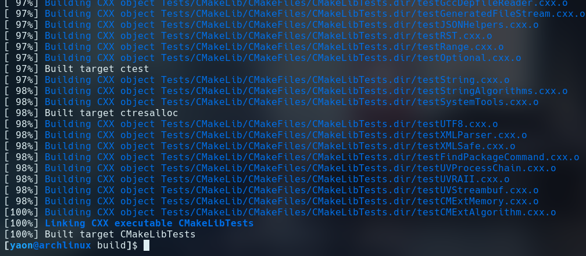
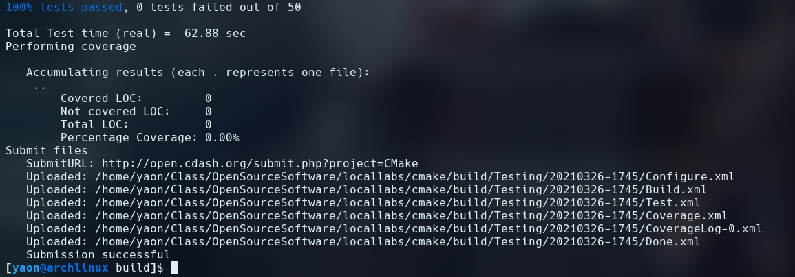
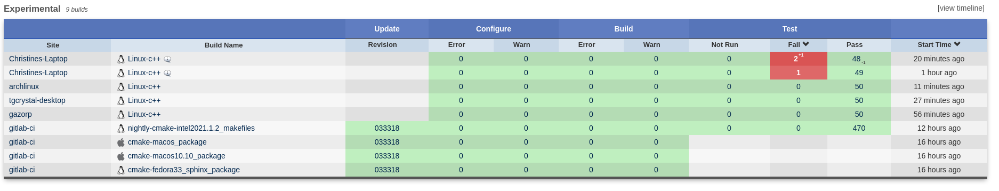
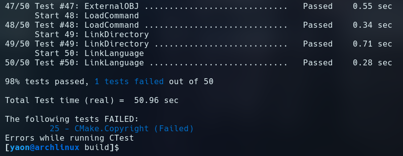
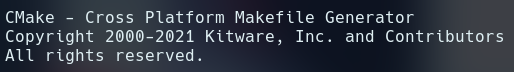
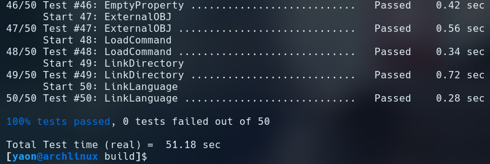

# Getting Started

# Executing Tests

For a particular submission, you can see which tests passed or failed by
clicking on the respective column entry. For example, for the
[Linux-Gentoo-Sparc32-gcc4.1](https://open.cdash.org/build/7124698) build,
there was [1 failed test](https://open.cdash.org/viewTest.php?onlyfailed&buildid=7124698)
and [552 passed tests](https://open.cdash.org/viewTest.php?onlypassed&buildid=7124698).

My build (the one labelled "archlinux" under experimental) didn't have any
errors present, which is relatively consistent with all the other builds titled
Linux-c++.

# Failing/Passing Tests

Failed Test:

The error message when run with the -VV flag provides a hint as to what the issue is:

The error can be fixed by changing the copyright to say 2021 instead of 2020:

The tests pass when this is changed:

