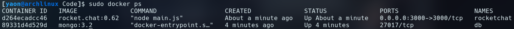
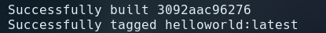
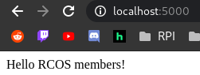

# Example 00

Scary Whale with `docker run docker/whalesay cowsay boo`:


# Example 01

Running `docker run -it ubuntu bash` to run a container with Ubuntu as the image:


Installing and using vim to create a testfile in /root:


Scary Cow with `cowsay`:


# Example 02

`docker ps` after running both containers



RocketChat running:


# Example 03

Dockerfile:
```
# Comments in Dockerfiles
FROM python:3.5

# Update and install dependencies
RUN apt-get update
RUN pip install Flask

# Add code
ADD . /opt/webapp/

# Set the working directory
WORKDIR /opt/webapp

# Set environment variables
ENV FLASK_APP=hello.py

# Expose the application's port
EXPOSE 5000

# Run the application
CMD ["flask", "run", "--host=0.0.0.0"]
```

Successful Dockerfile build using `docker build -t helloworld .`



Hello world at `localhost:5000` after running with `docker run -p 5000:5000 helloworld`


