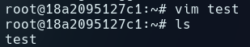

# Example 00

Scary Whale with `docker run docker/whalesay cowsay boo`:

# Example 01

Running `docker run -it ubuntu bash` to run a container with Ubuntu as the image:

Installing and using vim to create a testfile in /root:

Scary Cow with `cowsay`:

