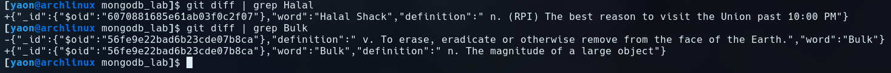

# MongoDB Licensing

TODO: Write this and link here

# Installing MongoDB

Successful connection through `mongo`:


"Connection Accepted" can be seen in the second line of the output image above.

# Importing Data

Successful import using `mongoimport`:


# Basic Queries

Successful finds after insert and update:


git diff:



# Driving Queries

checkpoint4.py:

```python
from pymongo import MongoClient
import pprint
client = MongoClient()

if __name__ == '__main__':
    db = client.mongo_db_lab

    # Fetch all records
    for definition in db.definitions.find():
        pprint.pprint(definition)

    # Fetch one record
    pprint.pprint(db.definitions.find_one())

    # Fetch a specific record
    word = db.definitions.find_one({"word": "B-Vector"})
    pprint.pprint(word)

    # Fetch a record by object id
    # Uses the id of the word in the previous query
    pprint.pprint(db.definitions.find_one({"_id": word['_id']}))

    # Inserting a new record
    new_word = {"word": "Commons Dining Hall",
                "definition": " n. (RPI) The best place to get grilled cheese sandwiches (if you're lucky)"}
    db.definitions.insert_one(new_word)
    pprint.pprint(db.definitions.find_one({"word": "Commons Dining Hall"}))
```

pprint output:


