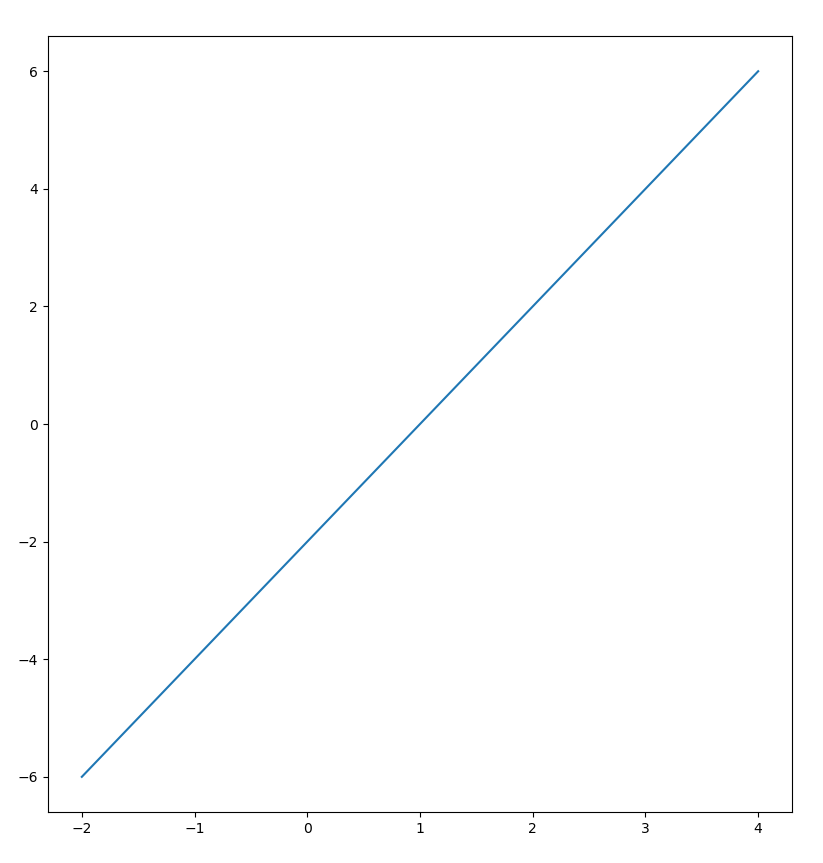
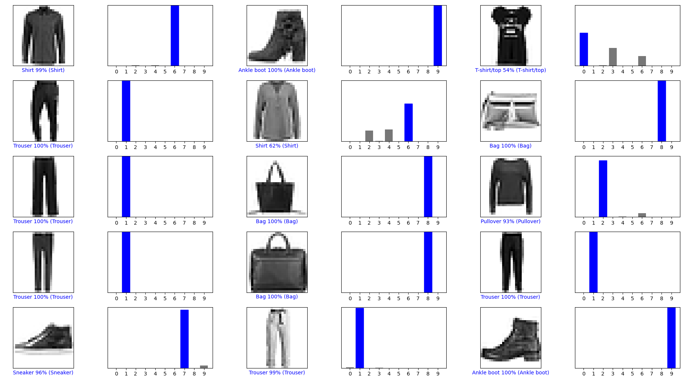
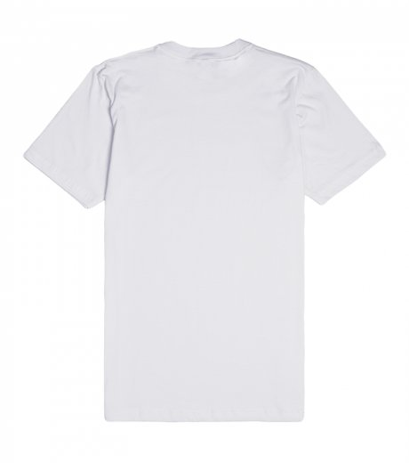
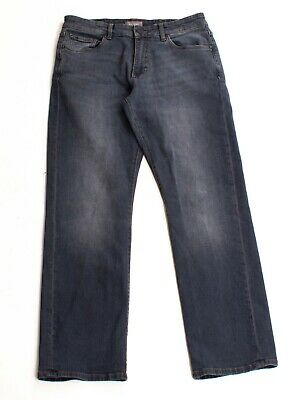
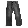
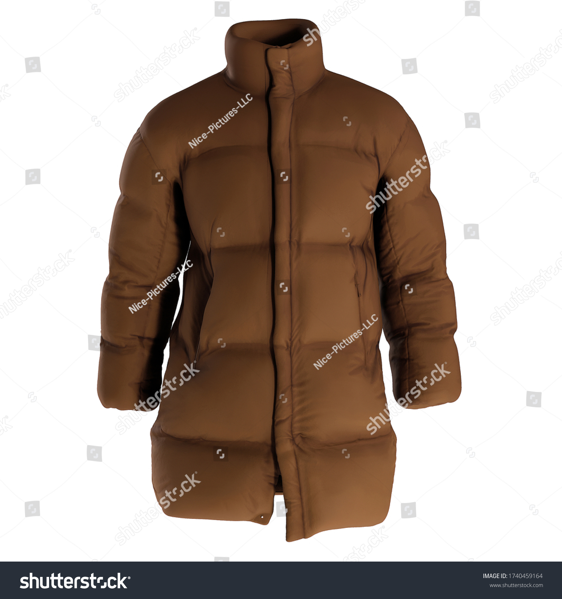
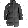

# Verifying Tensorflow

The code runs with output `2.5.0-rc1` for TensorFlow version and the following
graph:



# Running the Tensorflow Classification

The model, after running for 10 epochs, classifies images 9000-9014 in the test
set as such:



# Curating Data

### T-shirt

Original Image from [here](https://wheretoget.com/link/1578720):



Greyscale:


Output from model:

```
T-shirt: [[6.6076571e-01 1.6268854e-03 2.2323748e-02 3.5030104e-02 2.6411097e-03
  3.0113460e-04 2.7618167e-01 8.4490284e-06 1.0753456e-03 4.5792513e-05]]
0 T-shirt/top
```

### Jeans

Original Image from [here](https://www.ebay.com/itm/Mens-DL1961-Modern-Straight-Denim-Jeans-In-Render-Wash-Size-31-X-30-/283599188280):



Greyscale:



Output from model:

```
Jeans: [[6.4127316e-04 4.7062142e-03 2.3958189e-02 8.9736706e-05 9.6994197e-01
  5.9963746e-08 6.2559120e-04 9.5782861e-12 3.6987738e-05 2.0833127e-12]]
4 Coat
```

### Coat

Original Image from [here](https://www.shutterstock.com/image-illustration/mens-down-coat-3dimage-3d-render-1740459164):



Greyscale:



Output from model:

```
Coat: [[1.1534216e-03 1.2992586e-05 3.4404837e-02 2.7222685e-03 8.9499098e-01
  2.5366164e-06 6.6623308e-02 4.8437543e-10 8.9651141e-05 1.2216588e-08]]
4 Coat
```

In total, the model predicted two of the three images correctly (The t-shirt
and the coat). This is really interesting, since I wanted to try and see how
the model would perform on a noisy image (the coat, with watermarks) and
just assumed the other images were simple enough for the model to predict.
The model ended up guessing the coat correctly and not the jeans.
